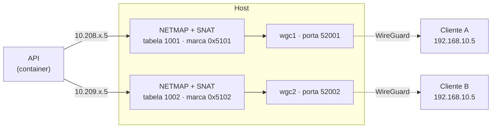

# SightOps

**Plataforma de operação de segurança eletrônica.** Uma instalação atende vários
clientes ao mesmo tempo — cada um com sua rede privada, seu inventário e seus
usuários — cobrindo CFTV, controle de acesso, botão de pânico, monitoramento,
rede GPON e projeto de instalação, no mesmo sistema.

Não é um VMS. Um VMS grava e exibe imagem; o SightOps **opera o parque**:
descobre o que existe em campo, configura equipamento, acompanha o que caiu,
documenta a instalação e responde a incidente — inclusive quando o equipamento
está atrás do CGNAT de um cliente, numa faixa de IP que colide com a de outro.

---

## Sumário

- [O que o sistema faz](#o-que-o-sistema-faz)
  - [CFTV: inventário, imagem e gravação](#cftv-inventário-imagem-e-gravação)
  - [Busca por IA na gravação](#busca-por-ia-na-gravação)
  - [Controle de acesso](#controle-de-acesso)
  - [Alerta: botão de pânico e coação](#alerta-botão-de-pânico-e-coação)
  - [Monitoramento e alarmística](#monitoramento-e-alarmística)
  - [Rede GPON, OLT e ONU](#rede-gpon-olt-e-onu)
  - [Switches, roteadores e ferramentas de rede](#switches-roteadores-e-ferramentas-de-rede)
  - [Projetos de CFTV e documentação](#projetos-de-cftv-e-documentação)
  - [Inventário de estações Windows](#inventário-de-estações-windows)
- [Conectores: um cliente não enxerga o outro](#conectores-um-cliente-não-enxerga-o-outro)
- [Arquitetura](#arquitetura)
- [Segurança](#segurança)
- [Instalação](#instalação)
- [Organização do repositório](#organização-do-repositório)
- [Operação](#operação)

---

## O que o sistema faz

### CFTV: inventário, imagem e gravação

O inventário não é digitado: o sistema **varre a rede** do cliente (HTTP direto,
pelo conector, ou a partir da tabela ARP do roteador) e identifica o que achou —
IP, MAC, fabricante, modelo, título do canal. Câmera, DVR, NVR e switch têm cada
um sua tela, porque cada um tem operação diferente.

| Recurso | Detalhe |
|---|---|
| Varredura e identificação | Intelbras, Hikvision, Dahua e genéricos ONVIF |
| Snapshot | Captura por marca (CGI/ONVIF na Intelbras, ISAPI na Hikvision), em lote e sob demanda |
| Ao vivo | WebRTC/HLS via go2rtc, com registro idempotente e limpeza de stream sem espectador |
| Playback | Clipe, quadro e imagem de um horário, direto do gravador |
| Configuração em campo | Trocar IP, aplicar NTP, renomear canal, reiniciar, aplicar título |
| Assistente de implantação | Cadastra o gravador, lê os canais existentes e **adiciona ou remove câmera no NVR** sem abrir a interface do fabricante |
| Acesso à interface do equipamento | Túnel WebSocket até a tela nativa da câmera/gravador, sem expor o equipamento na internet |
| Relatórios | PDF de inventário com foto, logotipo do cliente e capa configurável |

O "ver ao vivo" concentra o registro de stream num serviço único justamente
porque o modelo anterior derrubava o espectador anterior a cada nova abertura e
deixava credencial RTSP registrada para sempre no go2rtc.

### Busca por IA na gravação

Procurar uma ocorrência em horas de gravação é o trabalho mais caro da operação.
O módulo **IA no NVR** recebe uma descrição em linguagem natural e um intervalo,
baixa os trechos correspondentes do gravador e os submete a um modelo de visão
(Gemini), devolvendo os momentos candidatos com a hora de cada um.

Roda como **job assíncrono** — a busca continua no servidor enquanto o operador
usa o resto do sistema — e tem limite de chamadas por minuto e por hora, com
período de espera automático, para que o custo do modelo não escape.

### Controle de acesso

Módulo completo de credenciamento e portaria, com **48 rotas** de API, integrado a
leitoras faciais (Dahua/Intelbras) alcançadas pelo mesmo túnel das câmeras.

- **Pessoas** com CPF obrigatório e único, matrícula, foto facial, vínculo por
  site e importação em massa por planilha.
- **Dispositivos** (leitoras/catracas): cadastro, teste de conexão, importação
  das pessoas já existentes no equipamento e **abertura remota de porta** —
  registrada em log com o usuário que abriu.
- **Grupos de pessoas, grupos de portas e regras** de quem entra onde e quando.
- **Sincronização** da pessoa e da foto para cada leitora do grupo.
- **Ao vivo**: tela de eventos de acesso em tempo real, com a foto de quem passou.
- **Presença**: relatório de quem está dentro.
- **Notificações** por Telegram e WhatsApp, com antirrepetição para não virar spam.
- **Cadastro por WhatsApp**: o responsável manda nome e foto pelo WhatsApp; a
  mensagem cai numa **fila de triagem** onde um operador aprova, corrige ou
  rejeita antes de virar cadastro. Nada entra no sistema sem revisão humana.

### Alerta: botão de pânico e coação

Aplicativo de pânico para servidores em campo (professores, funcionários), com
atendimento pela central — desenhado para uso real sob ameaça.

- **O app não tem login do SightOps.** Ativa com um código de uso único gerado
  pela central e guarda um token de aparelho. A central pode revogar os aparelhos
  de uma pessoa a qualquer momento.
- **Coação:** a pessoa possui duas senhas. A normal cancela o alerta; a de coação
  **finge cancelar** — o app mostra exatamente a mesma tela nos dois casos e a
  resposta do servidor tem o mesmo formato, sem nenhum campo que um agressor
  olhando a tela consiga distinguir. Para a central, o alerta continua aberto e
  marcado como coação.
- **Localização só durante alerta aberto.** Fora de um incidente o app não envia
  e o servidor não guarda posição nenhuma.
- **Câmeras próximas:** ao abrir o incidente, a central recebe as câmeras dentro
  de um raio de 20 m do GPS, agrupadas por site. O raio se ajusta à precisão
  informada pelo aparelho, e quando não há câmera perto o sistema **diz que não
  há** em vez de listar a câmera errada de outro lugar.
- **Escalonamento automático** por tempo sem atendimento, com aviso no Telegram.
- **Freio antiabuso** na ativação: tentativas erradas em janela curta bloqueiam
  temporariamente a origem.

O aplicativo está em [`frontend/alerta/`](frontend/alerta/) e é empacotado como
APK via Capacitor.

### Monitoramento e alarmística

Zabbix e Grafana sobem **junto com a stack**, já provisionados — não é integração
com um Zabbix que alguém precisa montar antes.

- Disponibilidade de câmera, gravador, switch, OLT e ONU num painel único.
- Sinal óptico das ONUs com histórico.
- Sincronização de hosts com o Zabbix, incluindo **remoção** do que saiu do
  inventário (sem isso o Zabbix acumula host fantasma indefinidamente).
- Alerta por Telegram com perfis por tipo de equipamento.

### Rede GPON, OLT e ONU

Operação de rede óptica a partir da mesma tela, com 22 rotas dedicadas:

- Registro de OLTs com detecção de **capacidades por modelo** — o sistema só
  oferece a ação que aquele equipamento realmente suporta.
- Descoberta de ONUs não autorizadas, **autorização** (roteada ou bridge),
  localização, reinício, exclusão e leitura de sinal.
- Sincronização periódica do que está provisionado, com log de ação por ONU.
- Suporte a Fiberhome, Huawei, ZTE e VSOL.

### Switches, roteadores e ferramentas de rede

- Inspeção de switches **Intelbras e Hikvision**: portas, tabela MAC e ligação
  porta ↔ câmera.
- **PoE por porta**: ligar, desligar e reiniciar a alimentação de uma câmera
  travada, sem ir até o rack.
- **MikroTik pelo conector**: abre o Winbox do roteador do cliente na porta que
  aquele cliente usa (nem sempre é 8291), sem VPN manual.
- Ferramentas de diagnóstico: ping, varredura de porta e teste de alcance,
  executadas a partir da rede do cliente.

### Projetos de CFTV e documentação

Módulo de projeto, anterior à instalação:

- Projeto com sites, câmeras, switches, caixas/CTOs e vínculo entre eles.
- Catálogo de equipamentos com modelo e quantitativo.
- Importação por CSV e por **KMZ/KML** (Google Earth), com camadas.
- Geração de **KMZ** do projeto e exportação georreferenciada.
- **Documento de rede em PDF**: topologia, quantitativos e lista de materiais.

### Inventário de estações Windows

Agente para as estações do cliente: coleta configuração, gera relatório em PDF e
enriquece os registros com foto. O script do agente é gerado pelo próprio
sistema, já apontando para o servidor correto.

---

## Conectores: um cliente não enxerga o outro

Este é o ponto que separa o SightOps de um sistema comum de CFTV, e o que permite
atender vários clientes numa instalação só.

O problema: dois clientes usam `192.168.10.0/24`. Os dois têm uma câmera em
`192.168.10.5`. Os dois estão atrás de CGNAT, sem IP público. Num modelo de VPN
compartilhada, esses dois endereços colidem — e, pior, um cliente passa a
alcançar a rede do outro.

A solução implementada dá a **cada conector uma pilha de rede própria**:



A API nunca fala com o IP real: ela fala com um **IP virtual exclusivo daquele
conector**. O host traduz (NETMAP), marca o pacote, manda para a tabela de
roteamento daquele cliente e sai pela interface WireGuard dele. Dois clientes com
o mesmo IP privado jamais se cruzam, e isso funciona de dentro de um container em
rede bridge — onde amarrar o IP de origem não seria possível.

**O provisionamento é automático.** Ao criar um conector, o sistema aloca índice,
porta e faixa livres, gera o script pronto para colar no MikroTik do cliente e um
serviço no host cria a interface, as rotas e as regras de NAT sozinho. O cliente
não precisa escolher índice nem saber o IP do servidor — o endereço vai por URL,
não por IP fixo.

O provisionamento também **se conserta**: um conector antigo, criado antes do
isolamento, recebe índice e faixa corretos na primeira vez que a VPN é preparada.

---

## Arquitetura

Backend em **FastAPI** (Python), frontend em **HTML/CSS/JavaScript puro, sem
build**, banco em **PostgreSQL** (com SQLite suportado para instalação pequena),
tudo orquestrado por um único `docker compose`.

| Serviço | Papel |
|---|---|
| `cam-snapshot-api` | API, regras de negócio e jobs em segundo plano |
| `sightops-v3-nginx` | Serve o frontend e faz o roteamento HTTP |
| `sightops-v3-postgres` | Banco da aplicação |
| `go2rtc` | Transcodificação e entrega do ao vivo (WebRTC/HLS) |
| `zabbix-v3-*` | Servidor, banco, web e agente de monitoramento |
| `grafana-v3` | Painéis e histórico |
| `sightops-v3-iso-provisioner` | Cria no host as interfaces, rotas e NAT de cada conector |

São **mais de 340 rotas HTTP** em 23 módulos de API, com o inventário e as regras
sempre resolvidos dentro do tenant do usuário autenticado.

Detalhe que economiza tempo de quem for mexer: **o frontend não está dentro da
imagem** — é servido por bind-mount. Atualizar tela não exige rebuild, mas exige
subir o `?v=` do arquivo no `index.html`, senão o navegador continua servindo o
antigo.

---

## Segurança

**Autorização por papel.** `viewer` < `operator` < `admin` < `owner`, declarada em
[`app/core/security.py`](app/core/security.py). O padrão para rota de **escrita** é
**negar**: rota sem papel declarado responde 403 em vez de liberar. Isso é
verificável, e vale rodar em CI:

```bash
python scripts/audita_autorizacao.py --teto 0
```

O auditor importa os routers reais em vez de procurar por texto, porque rota
declarada com lista de métodos não aparece numa busca por padrão.

**Separação entre cliente e plataforma.** Ser `owner` do próprio cliente não dá
visibilidade sobre os demais: só o administrador de plataforma enxerga todos os
tenants.

**Credenciais cifradas.** Senhas de OLT e de equipamento são cifradas com
`SIGHTOPS_SECRET_KEY`.

**Duas coisas que não podem ser perdidas:**

- **`SIGHTOPS_SECRET_KEY`** — trocar ou perder essa chave torna ilegível tudo que
  já foi cifrado. Ela pertence ao backup junto do banco: um não serve sem o outro.
- **`data/`** — guarda `connectors.json`, com o token e a **chave privada de
  WireGuard de cada cliente**. Está no `.gitignore` e deve continuar fora de
  qualquer repositório.

Nenhum segredo, chave privada ou endereço de infraestrutura é versionado aqui.

---

## Instalação

Requisitos: Docker com Compose v2, e um host Linux com WireGuard disponível no
kernel (para os conectores).

```bash
git clone git@github.com:easytecnologias/sightops.git && cd sightops
cp .env.example .env.v3

openssl rand -hex 32          # gere o valor de SIGHTOPS_SECRET_KEY
nano .env.v3                  # preencha as obrigatórias, listadas no topo do arquivo

bash deploy/host-bootstrap/bootstrap-host.sh
docker compose -f docker-compose.production.yml --env-file .env.v3 up -d
```

Duas observações que evitam a maior parte dos tropeços:

1. O arquivo de ambiente chama-se **`.env.v3`**, não `.env` — é o nome que o
   `env_file:` do compose espera.
2. O `bootstrap-host.sh` prepara o que precisa existir **no host**, fora do
   Docker: WireGuard, `sysctl` e os scripts de roteamento por conector. Se algo
   obrigatório faltar, ele interrompe dizendo o quê — não sobe pela metade.

Para validar um `.env` antes de subir de verdade:

```bash
docker compose -f docker-compose.production.yml --env-file .env.v3 config >/dev/null && echo OK
```

---

## Organização do repositório

| pasta | conteúdo |
|---|---|
| `app/api/endpoints/` | rotas HTTP e WebSocket |
| `app/services/` | regras de negócio, drivers de equipamento e integrações |
| `app/core/` | autenticação, autorização, criptografia e contexto de tenant |
| `frontend/` | SPA servida pelo nginx |
| `frontend/alerta/` | aplicativo do botão de pânico |
| `ops/scripts/` | scripts que rodam **no host**: WireGuard, rotas e NAT por cliente |
| `deploy/` | nginx, Grafana, bootstrap do host |
| `migrations/` | migrações de banco (PostgreSQL e SQLite) |
| `scripts/` | utilitários e auditorias |
| `docs/` | documentação de operação |

---

## Operação

Build da imagem, atualização sem downtime, provisionamento de conector, backup e
restauração estão em **[`docs/DEPLOY.md`](docs/DEPLOY.md)**.

---

© Easy Tecnologias. Software proprietário — todos os direitos reservados.
